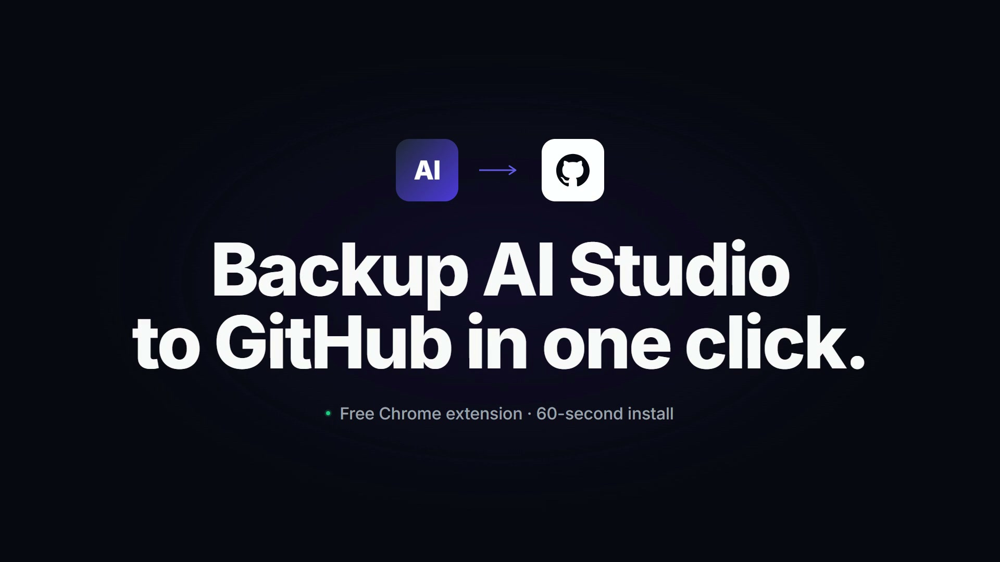

# GHL AI Studio → GitHub Exporter

A Chrome extension (MV3) that adds an **"Export to GitHub"** button to GoHighLevel's AI Studio editor. One click and your project is backed up to GitHub as a clean, atomic commit.

- Zero backend. All API calls run from your browser.
- GitHub OAuth Device Flow for auth — no client secret stored anywhere.
- Single atomic commit per push using the Git Data API.
- Tracks the GHL-project ↔ GitHub-repo link locally so subsequent clicks re-sync to the same repo without re-prompting.
- Refuses to overwrite repos that already have unrelated content (uses a marker file at the repo root for safety).

## Watch the install tutorial (45s)

[](assets/tutorial.mp4)

> Click the image to open the video. Or [download the MP4 directly](assets/tutorial.mp4).

## Install

This is an unpacked extension (not on the Chrome Web Store yet).

1. Download or clone this repo:
   ```bash
   git clone https://github.com/joe-jns/ghl-aistudio-exporter.git
   ```
2. Open `chrome://extensions` in Chrome (or any Chromium-based browser).
3. Toggle **Developer mode** on (top right).
4. Click **Load unpacked** and select the folder you just cloned.
5. Pin the extension icon to your toolbar.

That's it — no GitHub OAuth App registration needed. The extension ships with a pre-configured Client ID; on first use it asks GitHub to authorize **your** account against the extension's app, and the resulting access token lives only in your browser's local storage.

> Forking the extension and want your own OAuth App identity instead? See `config.example.js`.

## Use

1. Open an AI Studio project in GoHighLevel.
2. An **"Export to GitHub"** button appears in the editor toolbar, next to **Publish**.
3. Click it. A modal opens centered on the editor with the full flow:
   - First time: **Login with GitHub** → Device Flow (8-character code, paste it on github.com/login/device).
   - Pick **Create new repo** (name + private/public) or **Use existing repo** (typeahead).
   - Push. All your AI Studio source files land in one commit on `main`.
4. On the next click for the same project, the modal goes straight to **Push update** — no re-prompt.

The pushed repo is a stock Vite + React + TypeScript + Tailwind + shadcn/ui scaffold (which is what AI Studio produces). After cloning:

```bash
npm install
npm run dev
```

It runs.

## How the safety check works

On first push to any repo, the extension writes a tiny `.ghl-aistudio-sync.json` file at the repo root with the AI Studio project ID. On every subsequent push, it reads that marker:

- Marker matches the current project → push (overwriting code, preserving history).
- Marker matches a different project → refuse (you picked the wrong repo).
- Marker missing and repo has unrelated content → refuse (you'd lose someone else's work).
- Marker missing and repo is empty (or only an auto-generated README) → accept as first push.

## Running the tests

```bash
npm test
```

Pure-Node unit tests covering the marker round-trip and the GitHub push pipeline (bootstrap-on-empty-repo, blob → tree → commit → ref dance, error surfacing).

## Project layout

```
manifest.json          MV3 manifest
page-hook.js           MAIN-world script (captures bearer, injects button)
content-script.js      ISOLATED-world bridge + modal host
background.js          service worker / orchestrator
popup.html/css/js      shared UI (toolbar popup AND modal iframe)
config.example.js      copy to config.js with your GitHub OAuth Client ID
lib/                   pure modules: github-client, ghl-client, marker, storage,
                       messaging, github-device-flow
tests/                 node --test unit tests
icons/                 toolbar icons
```

## License

MIT.
